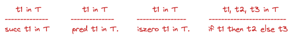
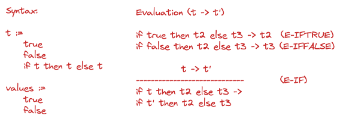
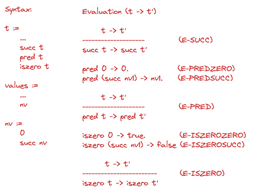

# 3. Untyped Arithmetic Expressions

Express and reason about the syntax and semanthics of programs.

Smal language of numbers and booleans.

**Concepts**: abstract syntax, inductive definitions and proofs, evaluation, runtime errors.

**Grammar**:

```haskell
data Term
    = TmTrue            -- true
    | TmFalse           -- false
    | ThIfTheElse t t t -- if t then t else t
    | TmZero            -- zero
    | TmSucc t          -- succ t
    | TmPred t          -- pred t
    | TmIsZero t        -- iszero t
```

**t** := Metavariable, *meta* - it is not a variable of the **object language** but rather of the metalanguage.

**metatheory** := a collection of true statements that we can make about some particular logical system.

**term** and **expression** are used interchangeably, for now. Eventually **term** will be computations (i.e., phrases that can be substituted for the metavariable t).

**values** "= The results of evaluation are terms of a particularly simple form: they will always be either boolean constants or numbers (nested applications of zero or more instances of succ to 0). 

Syntax of terms permits the formation of some **dubious-looking terms** like *succ true* and *if 0 then 0 else 0*. An eventual type system will exclude such expressions.

Equivalent ways to define a syntax:

**terms, inductively** - the set of terms is the smallest set *T* such that:
- {true, false, 0} are included in T
- if t1 is in T then {`succ t1`, `pred t1`, `iszero t1`} are in *T*.
- if t1, t2, and t3 are in T then *`if t1 then t2 else t3` are in *T*.

**terms, inference rules**



**terms, concretely**
- S0 = {}
- Si+1 = { trye, false, 0} and {succ ti, pred ti, iszero ti | ti in Si} and {if t1 then t2 else t3 | t1, t2, t3 in Si}
- S = reunion of all Si

**PROPOSITION** T = S

If t in T, then one of the 3 thigns must be true about t: (1) t is a *constant*, (2) t has the form *succ t1*, *pred t1*, *iszero t1* for some smaller term t1 or (3) t has the form *if t1 then t2 else t3* for some smaller terms t1, t2, t3.

**Contants** := the set of constants appearing in a term *t*, written *Consts(t)* is defined:
- Consts(true) = {true}
- Consts(false) = {false}
- Consts(0) = {0}
- Consts(succ t1) = Consts(t1)
- Consts(pred t1) = Consts(t1)
- Consts(iszero t1) = Consts(t1)
- Cosnts(if t1 then t2 else t3) = Consts(t1) V Consts(t2) V Consts(t3)

**Size** of the term *t*, written *size(t)* is defined:
- size(true) = 1
- size(false) = 1
- size(0) = 1
- size (succ t) = size(t) + 1
- size (pred t) = size(t) + 1
- size (iszero t) = size(t) + 1
- size (if t1 then t2 else t3) = size(t1) + size(t2) + size(t3) + 1

**Depth** of the term *t*, written *depth(t)* is defined:
- depth(true) = 1
- depth(false) = 1
- depth(0) = 1
- depth(succ t) = depth(t) + 1
- depth(pred t) = depth(t) + 1
- depth(iszero t) = depth(t) +  1
- depth(if t1 then t2 else t3) = max(depth(t1), depth(t2), depth(t3)) + 1

**Proof** by induction on t:
- case t = true ... show P(true) ...
- case t = false ... show P(false) ...
- case t = if t1 then t2 else t3 ... show P(if t1 then t2 else t3), using P(t1), P(t2), P(t3) ...

**Semantic styles**:
- Operation semantics
- Denotational semantics
- Axiomatic semantics

**Operational semantics** of boolean epxressions:



*left-hand* column defines the **grammar and values**.

*right-hand* column defines an **evaluation relation**: *t evaluates to t' in one step*. 

The constants *true* and *false* dont evaluate to anything since they do not appear in the left-side of the rules. 
There is no rule allowing the evaluation of a then- or else- subexpression of an if before evaluating the if itself. For example, the term *if true then (if false then false else false) else true* does not evaluate to *if true then false else true*. *E-IFTRUE* and *E-IFFALSE* are *computation rules* and *E-IF* is a *congruence rule*.

The *one-step evaluation* relation is the smallest binary relation on terms satisfying the 3 rules. When the pair *(t, t')* is in the evaluation relation, we say that *the evaluation statement (or judgement) t -> t' is derivable*.

Determinacy of one-step evaluation: *if t -> t' and t -> t'' then t' = t''*.

**Normal form**: A term *t* is in *normal form* if no evaluation rule applies to it (ie if there is no t' such that t -> t'). *true* and *false* are in normal forms in the present system. *Every value* is in normal form. Normal forms that are not values play a critical role in **run-time errors**.

**Multi-step evaluation** relation ->* is thereflexive, transitive closure of *one-step evaluation*. It is the smallest relation such: (1) if t -> t' then t ->* t', (2) t ->* t, and (3) if t -> t' and t' -> t' then t ->* t''.

**Uniueness of normal forms**: if t ->* u and t ->* u' and u and u' are normal forms then u = u'.

**Termination of evaluation**: for every term t there is some normal form t' such t ->* t'.

**Evaluation of arithmetic expressions**:



The syntactic category of *numeric values* (nv) plays an important role in these rules. In E-PredSucc, for example, the fact that the left-hand side is *pred (succ nv1)* (rather than pred (succ t1), for example) means that this rule cannot be used to evaluate *pred (succ (pred 0))* to *pred 0*.

**Stuck**: A closed term is *stuck* if it is in *normal* form but not *value*. *Stuckness* gives us a simple notion of **run-time error** for our simple machine. The case when the operational semantics dont know what to do because the program reached a *meaningless state*.

**Badstate**: 
- badnat := wrong | true | false
- badbool := wrong | nv

**Big-step** semantics: this term evaluates to the final value. t => v
