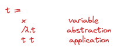

# 5. The Untyped Lambda Calculus

**Abstract syntax** = simpler internal representation of the program as labeled trees *Abstract Syntax Tree* (AST).

**Application** associates to the left: *s t u* = *(s t) u*.

**Abstractions** their bodies extend as far to the right as possible.

**Bound** = An occurence of the variable *x* is said to be *bound* when it occurs in the body *t* of an abstraction *λx.t*. It is bound by this abstraction.

**Free** = An occurence of the variable *x* is said to be *free* if it appears in a position where it is not bound be an enclosing abstraction.

**Closed** = A term without free variables.

**Combinators** = Closed term.

**Identity function** = *λx.x* is the simplest combinator.

**Beta-reduction** = the operation of re-writing a *redex*

**Evaluation strategies** =

- **Full beta-reduction** any redex maybe reduced at any time.
- **Normal order** the leftmost, outermost redex is always reduced. Each term t evaluates in one step to at most term t'.
- **Call-by-name** allows no restrictions inside abstractions. Haskell is using a variant - *call-by-need*
- **Call-by-value** only outermost redex are reduced and where redex is reduced only when its right-hand side has already been reduced to a value.

**Strict** = the *call-by-value* is strict, the arguments to functions are always evaluated, whether or not they are used in the body.

**Lazy** (non-strict) = the *call-by-name* or *call-by-need* - evaluate only the arguments that are actually used.

**Diverge** = a term that cannot be evaluated to a normal form.

**Fixed-point combinator** = used to define recursive functions

